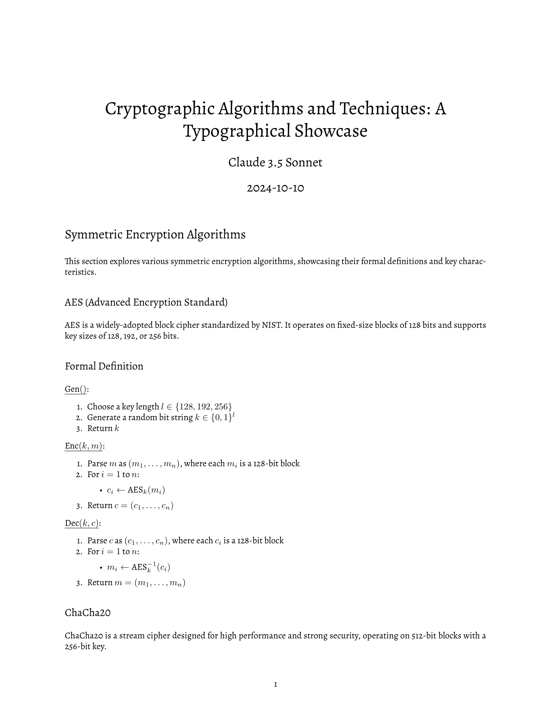
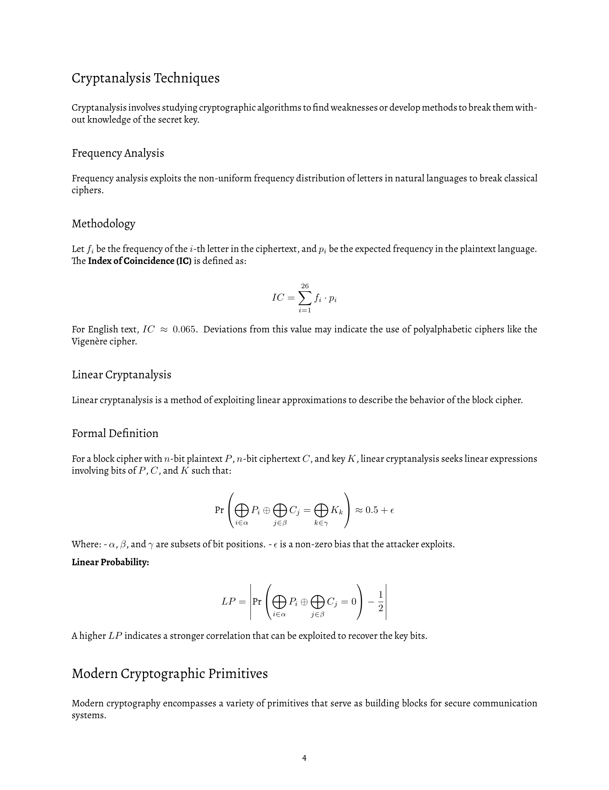

# redpaper

a containerized environment for authoring documents, including my personal templates.

uses [pandoc](https://pandoc.org/) to convert markup to latex.

# flagship theme (`style2`):

vibes:
+ `classic` (default)
+ `alternate`
+ `forward`
+ `orthographic`
+ `professional`
+ `artistic`


 

# usage

## redpaper host

build the container image:

```sh
podman build . -f redpaper_host.docker -t redthing1/redpaper_host
```

## example usage

within this repository, run a shell with the templates available:

```sh
podman run --rm -it -v $(pwd):/prj -v $(pwd):/data redthing1/redpaper_host
```

render some examples (within container shell):
```sh
pandoc --dpi=300 --pdf-engine=lualatex --template /data/templates/style2/style2-template.tex -i ./examples/crypto_showcase.md -o ./examples/crypto_showcase_style2.pdf
```
